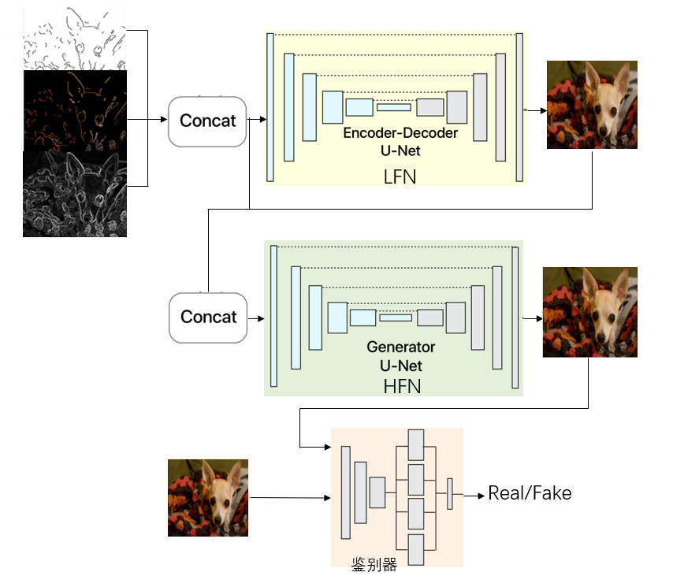
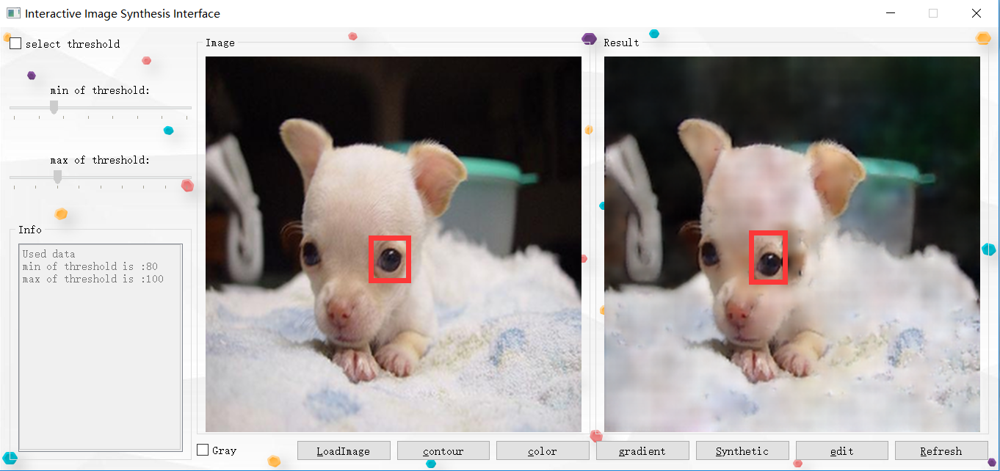

# image_synthesis
这是一个基于稀疏轮廓的图像合成系统，这个系统使用户能够在指定区域上以直观的方式编辑轮廓图从而合成令用户满意的图像。该系统模型采用一种基于生成对抗网络的新方法来解决高保真度和高稀疏度之间的冲突。即使在没有提供大区域输入信息的情况下，该模型也并不强制轮廓来模拟纹理，细节和精细结构，而是从稀疏轮廓表示中学习。为此，该模型使用了两个网络级联来合成图像，并将整个任务分解为两个更加易于处理的问题。第一个网络重建整体图像结构和颜色，而第二个网络用来恢复纹理和细节。
系统界面提供了图像编辑工具，用户可以实时编辑给定的图像轮廓区域，该界面实时运行，并促进互动和迭代工作流程，将编辑后的轮廓图、梯度信息以及颜色信息进行”concat”连接，最终合成一张全新的图片。

本文主要采用生成式对抗网络来训练，其中生成器部分使用两个“U-Nets”级联从稀疏N信道特征映射（通常N = 3或N = 6）重建图像，使用 ReLU[7]、LeakyReLU激活函数并进行批量归一化；鉴别器的结构是一个“patch discriminator” [13]和扩张卷积滤波器的一个分支的组合；使用L2像素损失计算原图像和真实图像之间的loss。

网络结构图如下：

论文所用数据集为stanford dogs，训练集大小为1W5，测试集大小为5000，图片大小均为256×256，在所有训练运行中批量大小为16，迭代20W。

代码提供一个可编辑的交互工具，允许用户自己进行编辑,如下：

